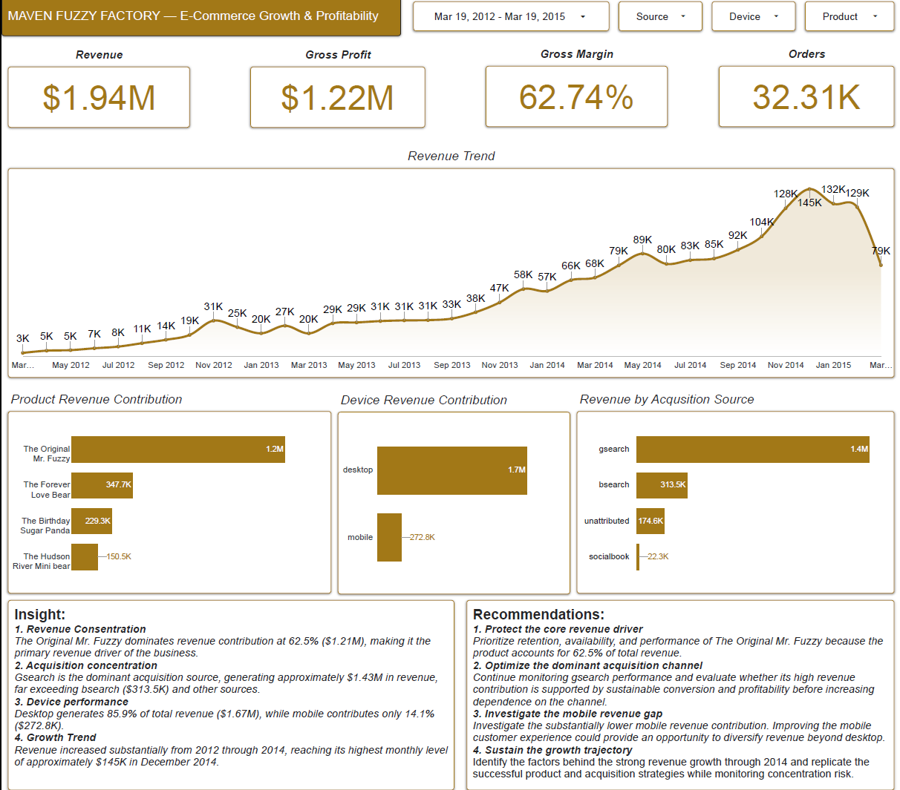
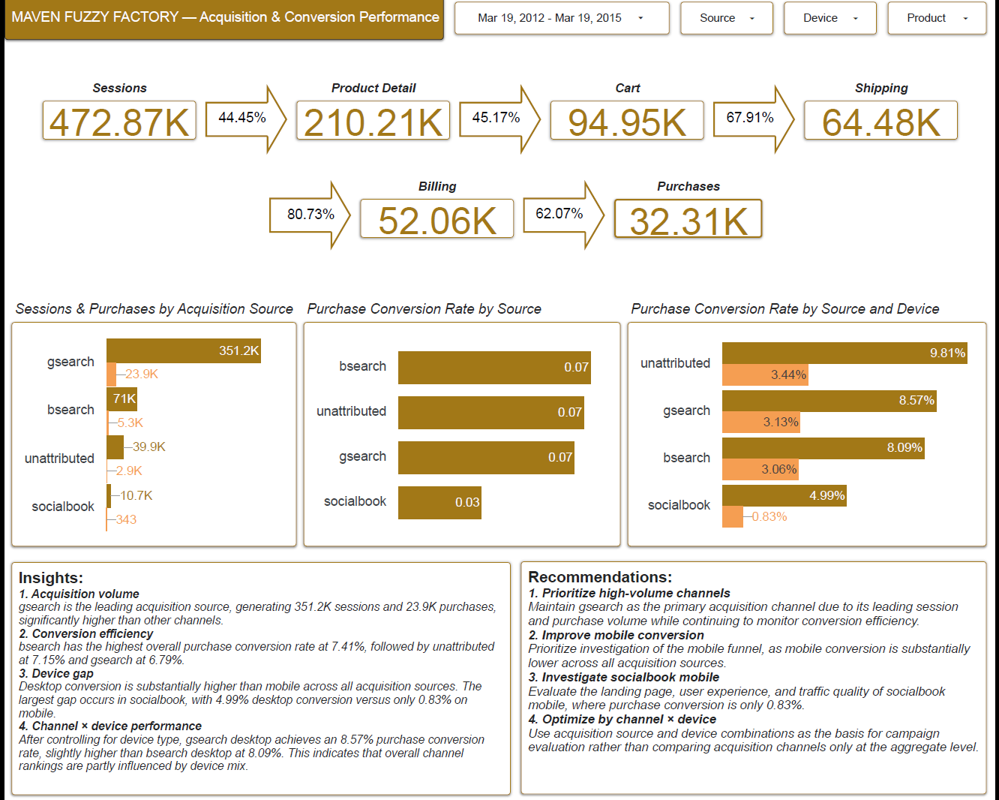
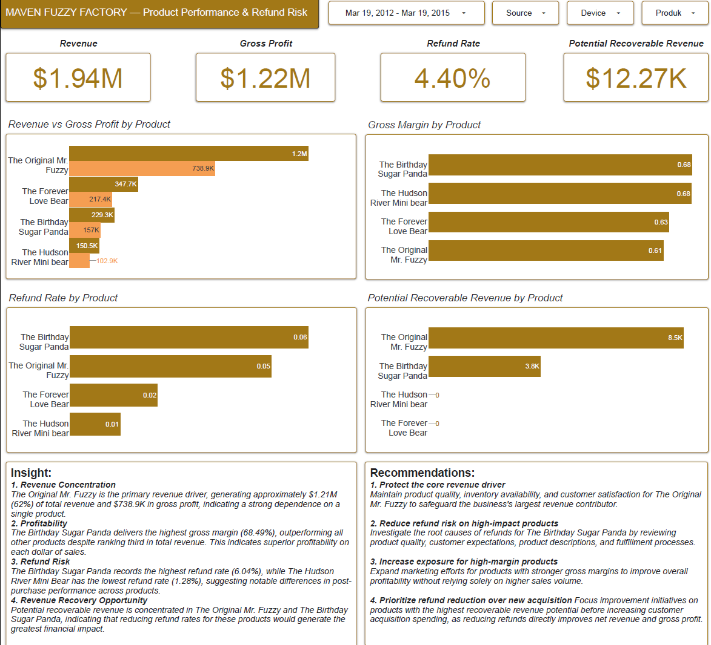

# 📊 Interactive Dashboard

This folder contains the interactive business intelligence dashboard developed in **Google Looker Studio** using curated data marts built in **Google BigQuery**.

The dashboard transforms raw transactional e-commerce data into actionable business insights across three analytical areas:

- Business Performance
- Customer Funnel Analysis
- Refund Analysis

---

# Dashboard Preview

> Full Interactive Dashboard:
> (https://datastudio.google.com/reporting/90f69ea2-54da-4abb-a221-e1eeea32f6f0)

  
---

# Dashboard Structure

| Page | Focus | Data Mart |
|-------|-------|-----------|
| Business Performance | Overall business performance | mart_business_performance |
| Customer Funnel | Customer journey and conversion funnel | mart_customer_funnel |
| Refund Analysis | Product refund performance | mart_refund_analysis |

---

# Page 1 — Business Performance


## Objective

Monitor overall business performance by evaluating revenue, profitability, acquisition channels, customer devices, and product performance.

### Key Performance Indicators (KPIs)

- Total Revenue
- Gross Profit
- Gross Margin
- Average Order Value (AOV)
- Total Orders

### Visualizations

- Revenue Trend
- Revenue by Product
- Revenue by Acquisition Source
- Revenue by Device
- Product Profitability
- Revenue Distribution

### Key Insights

- Revenue increased consistently throughout the observation period, indicating sustained business growth.
- **The Original Mr. Fuzzy** generated approximately **62.5% of total revenue**, making it the primary revenue driver.
- **gsearch** contributed the highest revenue among acquisition channels.
- Desktop users generated substantially higher revenue than mobile users.
- Revenue concentration on a single product suggests elevated product dependency risk.

### Business Recommendations

- Prioritize inventory availability, marketing investment, and customer retention for **The Original Mr. Fuzzy** while reducing long-term dependency through product portfolio diversification.
- Continue investing in **gsearch**, but regularly monitor conversion efficiency and profitability before increasing acquisition spending.
- Improve the mobile shopping experience to increase revenue contribution from mobile users.
- Replicate the acquisition and product strategies that supported revenue growth while monitoring concentration risk.

---

# Page 2 — Customer Funnel


## Objective

Evaluate customer progression throughout the purchasing journey and identify conversion opportunities by acquisition source, device type, and product.

### KPIs

- Product Detail Sessions
- Cart Sessions
- Shipping Sessions
- Billing Sessions
- Purchase Sessions

### Visualizations

- Overall Funnel
- Funnel by Acquisition Source
- Funnel by Device
- Funnel by Product
- Product Purchase Conversion

### Key Insights

- Funnel conversion consistently decreases at each purchase stage.
- Mobile users experience significantly lower purchase conversion than desktop users.
- **socialbook (mobile)** records the weakest purchase conversion, approximately **0.83%**.
- Conversion performance varies considerably across acquisition source and device combinations.

### Business Recommendations

- Prioritize investigation of the mobile purchasing journey to identify usability barriers.
- Review landing pages and customer experience for **socialbook mobile** campaigns.
- Evaluate marketing performance using both acquisition source and device segmentation rather than acquisition source alone.
- Improve checkout usability to reduce abandonment in the later stages of the funnel.

---

# Page 3 — Refund Analysis


## Objective

Analyze refund performance to identify products with elevated refund risk and estimate potential revenue recovery opportunities.

### KPIs

- Total Refund Amount
- Refund Rate
- Net Revenue After Refund
- Gross Profit After Refund
- Recoverable Revenue

### Visualizations

- Refund Rate by Product
- Refund Amount Trend
- Gross Profit After Refund
- Recoverable Revenue
- Product Profitability

### Key Insights

- **The Birthday Sugar Panda** exhibits the highest refund rate among all products.
- Refunds directly reduce both net revenue and gross profit.
- Certain products generate substantially higher recoverable revenue potential than others.
- Improving refund performance provides an opportunity to increase profitability without acquiring additional customers.

### Business Recommendations

- Investigate the underlying causes of refunds for **The Birthday Sugar Panda**, including product quality, customer expectations, product descriptions, and fulfillment processes.
- Prioritize improvement initiatives for products with the highest recoverable revenue potential.
- Expand marketing investment toward products with stronger profit margins and lower refund rates.
- Reduce refund rates before increasing acquisition spending to maximize profitability.

---

# Dashboard Development Workflow

```
Raw Tables
      │
      ▼
Data Understanding
      │
      ▼
Data Cleaning
      │
      ▼
Exploratory Data Analysis
      │
      ▼
Business Data Marts
      │
      ▼
Google Looker Studio Dashboard
```

---

# Technology Stack

- Google BigQuery
- SQL (Standard SQL)
- Google Looker Studio
- GitHub

---

# Related Resources

- Main Project Documentation → ../README.md
- SQL Scripts → ../sql/
- Documentation → ../documentation/
