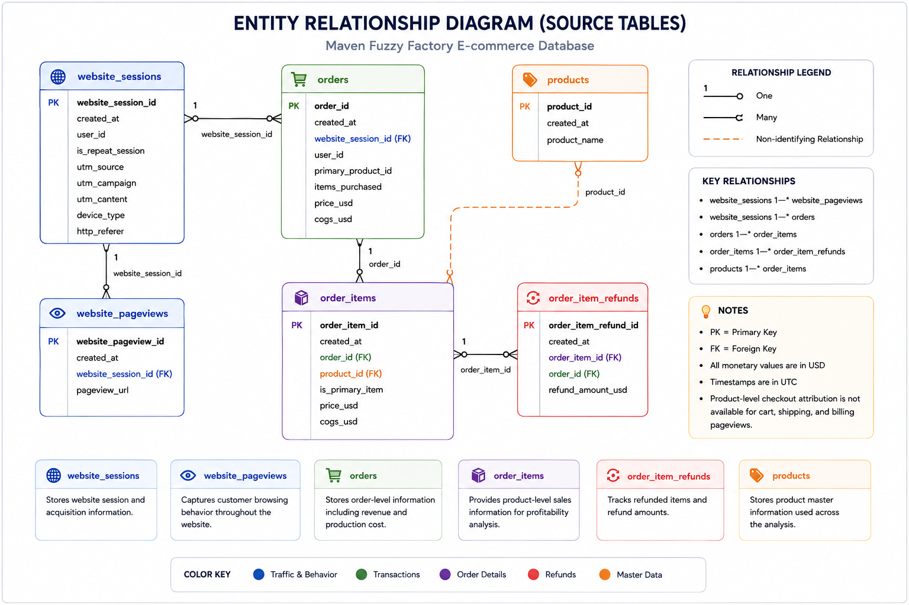

# Dataset Overview

This project uses the Maven Fuzzy Factory e-commerce dataset.

The dataset consists of six relational tables that capture website traffic, customer behavior, transactions, product information, and refunds.

## Source Tables

| Table | Description |
|--------|-------------|
| website_sessions | Website session and acquisition information |
| website_pageviews | Customer browsing behavior |
| orders | Customer orders |
| order_items | Purchased products |
| order_item_refunds | Refunded order items |
| products | Product master data |

The dataset is transformed into analytical data marts using SQL in Google BigQuery before being visualized in Looker Studio.

## Entity Relationship Diagram

