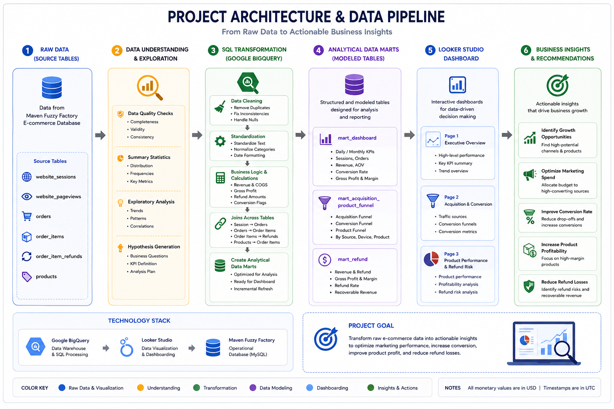

# Maven Fuzzy Factory E-commerce Performance Analysis

## Project Overview

This project analyzes the performance of Maven Fuzzy Factory, an e-commerce business selling stuffed animal products. The objective is to evaluate customer acquisition, conversion funnel performance, product profitability, and refund behavior using SQL, Google BigQuery, and Looker Studio.

The project follows a complete analytics workflow, starting from raw transactional data exploration, data cleaning, exploratory data analysis (EDA), development of analytical data marts, and interactive dashboard visualization for business decision-making.

---

## Business Problem

The business aims to understand:

- Which marketing channels generate the highest business value.
- Where customers drop off during the purchasing journey.
- Which products contribute the most to revenue and profit.
- Which products experience excessive refund rates.
- How refund performance impacts profitability.

---

## Project Objectives

- Assess overall business performance.
- Analyze customer acquisition channels.
- Evaluate customer conversion funnel.
- Measure product-level sales performance.
- Identify refund-related revenue leakage.
- Provide actionable business recommendations.

---

## Dataset

**Source**

Maven Analytics – Maven Fuzzy Factory Dataset

**Raw Tables**

| Table | Description |
|--------|-------------|
| website_sessions | Website visitor sessions |
| website_pageviews | Customer page navigation |
| orders | Completed customer orders |
| order_items | Individual products purchased |
| order_item_refunds | Product refunds |
| products | Product master table |

Additional documentation is available in the **dataset** folder.

---

## Project Architecture


---

## Entity Relationship Diagram (ERD)


---

## Technology Stack

| Category | Tools |
|----------|------|
| SQL | Google BigQuery |
| Data Cleaning | SQL |
| Data Modeling | SQL View (Data Mart) |
| Dashboard | Google Looker Studio |
| Documentation | GitHub Markdown |

---

## Project Workflow

```
Raw Dataset
      │
      ▼
Data Understanding
      │
      ▼
Data Cleaning
      │
      ▼
Exploratory Data Analysis
      │
      ▼
Business Data Mart
      │
      ▼
Interactive Dashboard
      │
      ▼
Business Insights & Recommendations
```

---

## Data Mart

Three analytical data marts were developed to support dashboard reporting.

| Data Mart | Purpose |
|-----------|---------|
| mart_business_performance | Business KPI and profitability analysis |
| mart_customer_funnel | Customer acquisition and conversion funnel |
| mart_refund_analysis | Product refund performance analysis |

---

## Dashboard

The dashboard consists of three analytical pages.

### 1. Business Performance


---

### 2. Customer Acquisition & Product Funnel


---

### 3. Refund Analysis


---

## Interactive Dashboard

View the interactive dashboard here:

**Google Looker Studio**

*(https://datastudio.google.com/reporting/90f69ea2-54da-4abb-a221-e1eeea32f6f0)*

---

## Key Insights

### Business Performance

- The Original Mr. Fuzzy dominates revenue contribution at 62.5% ($1.21M), making it the primary revenue driver of the business.
- Gsearch is the dominant acquisition source, generating approximately $1.43M in revenue, far exceeding bsearch ($313.5K) and other sources.
- Desktop generates 85.9% of total revenue ($1.67M), while mobile contributes only 14.1% ($272.8K).
- Revenue increased substantially from 2012 through 2014, reaching its highest monthly level of approximately $145K in December 2014.
  
### Customer Funnel

- gsearch is the leading acquisition source, generating 351.2K sessions and 23.9K purchases, significantly higher than other channels.
- bsearch has the highest overall purchase conversion rate at 7.41%, followed by unattributed at 7.15% and gsearch at 6.79%.
- Desktop conversion is substantially higher than mobile across all acquisition sources. The largest gap occurs in socialbook, with 4.99% desktop conversion versus only 0.83% on mobile.
- After controlling for device type, gsearch desktop achieves an 8.57% purchase conversion rate, slightly higher than bsearch desktop at 8.09%. This indicates that overall channel rankings are partly influenced by device mix.
  
### Refund Analysis

- The Original Mr. Fuzzy is the primary revenue driver, generating approximately $1.21M (62%) of total revenue and $738.9K in gross profit, indicating a strong dependence on a single product.
- The Birthday Sugar Panda delivers the highest gross margin (68.49%), outperforming all other products despite ranking third in total revenue. This indicates superior profitability on each dollar of sales.
- The Birthday Sugar Panda records the highest refund rate (6.04%), while The Hudson River Mini Bear has the lowest refund rate (1.28%), suggesting notable differences in post-purchase performance across products.
- Potential recoverable revenue is concentrated in The Original Mr. Fuzzy and The Birthday Sugar Panda, indicating that reducing refund rates for these products would generate the greatest financial impact.
  
---

## Business Recommendations

### Business Performance

- Prioritize retention, availability, and performance of The Original Mr. Fuzzy because the product accounts for 62.5% of total revenue.
- Continue monitoring gsearch performance and evaluate whether its high revenue contribution is supported by sustainable conversion and profitability before increasing.
- Investigate the substantially lower mobile revenue contribution. Improving the mobile customer experience could provide an opportunity to diversify revenue beyond desktop.
- Identify the factors behind the strong revenue growth through 2014 and replicate the successful product and acquisition strategies while monitoring concentration risk.

### Customer Funnel

- Maintain gsearch as the primary acquisition channel due to its leading session and purchase volume while continuing to monitor conversion efficiency.
- Prioritize investigation of the mobile funnel, as mobile conversion is substantially lower across all acquisition sources.
- Evaluate the landing page, user experience, and traffic quality of socialbook mobile, where purchase conversion is only 0.83%.
- Use acquisition source and device combinations as the basis for campaign evaluation rather than comparing acquisition channels only at the aggregate level.

### Refund Analysis

- Maintain product quality, inventory availability, and customer satisfaction for The Original Mr. Fuzzy to safeguard the business's largest revenue contributor.
- Investigate the root causes of refunds for The Birthday Sugar Panda by reviewing product quality, customer expectations, product descriptions, and fulfillment processes.
- Expand marketing efforts for products with stronger gross margins to improve overall profitability without relying solely on higher sales volume.
- Focus improvement initiatives on products with the highest recoverable revenue potential before increasing customer acquisition spending, as reducing refunds directly improves net revenue and gross profit.
  
---

## Repository Structure

```
Maven-Fuzzy-Factory-Analysis
│
├── dataset/
├── dashboard/
├── images/
├── sql/
│
├── README.md
├── LICENSE
└── .gitignore
```

---

## SQL Workflow

```
01_data_understanding.sql

        ↓

02_data_cleaning.sql

        ↓

03_exploratory_data_analysis.sql

        ↓

04_mart_business_performance.sql

        ↓

05_mart_customer_funnel.sql

        ↓

06_mart_refund_analysis.sql
```

---

## Skills Demonstrated

- SQL (Google BigQuery)
- Data Cleaning
- Exploratory Data Analysis
- Data Modeling
- Data Mart Development
- Marketing Analytics
- Customer Funnel Analysis
- Product Performance Analysis
- Refund Analysis
- Business Intelligence
- Dashboard Development
- Data Visualization

---

## Author

**Ahmad Rasyid Dalimunthe**

Data Analyst

LinkedIn: *(https://www.linkedin.com/in/ahmad-rasyid-dalimunthe)*

GitHub: *(https://www.github.com/ahmad-rasyid-dalimunthe)*
